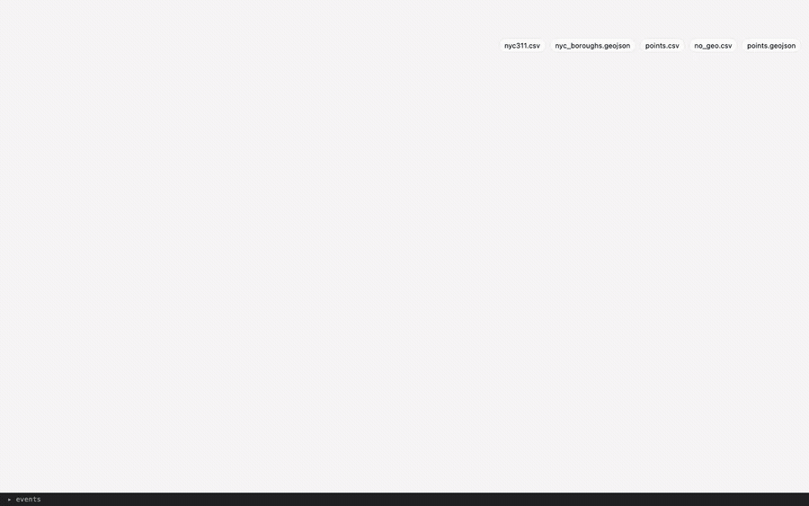
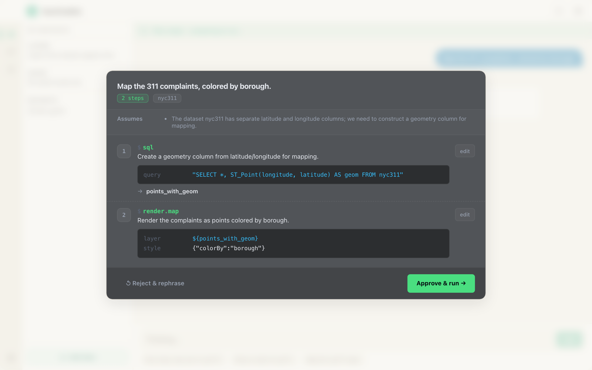
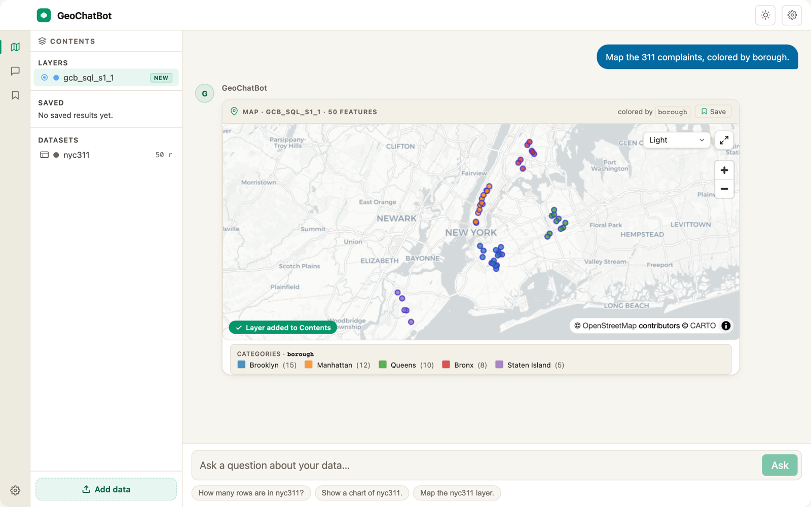

# GeoChatBot

**A browser-native AI agent for spatial data analysis — zero backend, your files never leave the browser.**

[](https://github.com/GoshtasbSh/GeoChatBot/actions/workflows/ci.yml)
[](LICENSE)
[](#contributing)
[](https://www.typescriptlang.org/)



<p align="center"><em>Ask questions about your own spatial data in plain English — everything runs in your browser.</em> &nbsp;·&nbsp; <a href="docs/media/demo.mp4">▶ watch the MP4</a></p>

---

## Why it's interesting

- **Zero backend — privacy by architecture.** You drop a file into the browser tab; it's parsed to Apache Arrow and queried by DuckDB-WASM *locally*. The only network egress is the LLM API call, and it carries **your question and the column schema — never your data rows**.
- **Plan-then-execute agent with a human approval gate.** Every run emits a numbered plan over **28 typed, schema-validated tools** (SQL, geometry, spatial joins, stats, geocoding, rendering). You **approve or reject the plan before anything executes** — no free-form code generation ([ADR&nbsp;0003](docs/adr/0003-tool-calling-over-codegen.md)).
- **In-browser hybrid RAG.** Few-shot exemplars are retrieved with **MiniLM-L6-v2 embeddings** (transformers.js) + **BM25** lexical search, fused with **Reciprocal Rank Fusion** — all client-side, no embedding server.
- **DuckDB-WASM spatial SQL over Apache Arrow.** Real `ST_*` spatial SQL on columnar, zero-copy data, entirely in WebAssembly.
- **Bring-your-own-LLM — 5 providers.** Groq, Google Gemini, OpenAI, Anthropic, and any OpenAI-compatible endpoint. Your key stays in `localStorage` and is sent only to the provider you pick.

## Live demo & quickstart

> **Live demo:** _deploying — URL will be added here._ Bring your own free [Groq](https://console.groq.com/keys) or [Gemini](https://aistudio.google.com/app/apikey) key; a sample NYC-311 dataset is preloaded so you can see the UI immediately.

**Run it locally in three commands:**

```bash
pnpm install          # Node ≥ 20, pnpm 9
pnpm demo             # standalone demo app  → http://localhost:5174
# open the ⚙ settings drawer, paste a Groq/Gemini/OpenAI/Anthropic key, ask away
```

**Embed the widget** (one script tag, full UI):

```html
<script type="module" src="/geochatbot.js"></script>
<geo-chatbot dangerously-allow-browser></geo-chatbot>
```

Build the embeddable bundle with `pnpm build:widget` (emits `packages/widget/dist/geochatbot.js`). Attributes: `mode="full|headless"`, `agentic-mode="agentic"`, `theme="auto|light|dark"`, `persist-api-key`. In `headless` mode the widget renders no UI and emits typed `CustomEvent`s (`plan`, `progress`, `result`) so you can drive your own dashboard.

## Architecture


A file dropped in the browser is parsed by **loaders.gl** into **Apache Arrow**, then queried by **DuckDB-WASM** with the spatial extension. The **plan-then-execute agent** drafts a numbered plan; you approve it at the **gate**; the **executor** runs each step against the typed tool registry, with a **Critic** that self-heals a failed step up to 2×. Results render through **MapLibre GL + deck.gl**. The LLM providers sit *outside* the browser boundary and receive only your question and the data's column schema — never its rows. See [`docs/CAPABILITIES.md`](docs/CAPABILITIES.md) and the [ADRs](docs/adr/).

<table>
<tr>
<td width="50%"><br><sub><b>The approval gate</b> — a typed plan (spatial SQL → render) you approve before anything runs.</sub></td>
<td width="50%"><br><sub><b>Rendered locally</b> — MapLibre GL + deck.gl, colored by category with a legend.</sub></td>
</tr>
</table>

## Features

| | Supported |
|---|---|
| **Input formats** | CSV · TSV · GeoJSON · Shapefile (`.zip`) · Parquet · Excel (`.xlsx`) |
| **Spatial ops** | buffer · centroid · convex hull · union · intersect · difference · dissolve · simplify · point-in-polygon · spatial join · nearest-neighbor · geocoding |
| **Analysis** | arbitrary DuckDB spatial SQL · aggregation · summary stats · distance matrix · bucketize · quick-scan profiling |
| **Outputs** | interactive map · chart · table · text summary |
| **LLM providers** | Groq · Gemini · OpenAI · Anthropic · OpenAI-compatible |

## Engineering quality

- **960 passing tests** across 97 files ([Vitest](https://vitest.dev)) — loaders, tools, planner, executor, RAG, and UI. Run `pnpm test`.
- **Playwright E2E** specs driving the real widget ([`e2e/`](e2e/)) — plan/approval happy-path, plan editing, headless mode.
- **Python eval harness** ([`packages/eval/`](packages/eval/)) that benchmarks multiple models against a task set and emits a leaderboard (`--models a,b,c`).
- **Architecture Decision Records** ([`docs/adr/`](docs/adr/)) — [tool-calling over code-gen](docs/adr/0003-tool-calling-over-codegen.md), [plan-then-execute](docs/adr/0002-plan-then-execute.md), [shadow-DOM web component](docs/adr/0004-web-component-shadow-dom.md).
- **CI** on every push/PR: install → Biome lint → typecheck → test → build ([`.github/workflows/ci.yml`](.github/workflows/ci.yml)).
- **Monorepo** (`packages/widget` · `site` · `demo` · `eval` · `e2e`) — strict TypeScript, `@duckdb/duckdb-wasm`, `maplibre-gl`, `@deck.gl/*`, `lit`, `apache-arrow`, `@xenova/transformers`.

## Honest limitations

I'd rather you know these up front:

- **CRS reprojection is a passthrough.** `geometry.reproject` is registered but currently returns the layer unchanged (proj4js isn't bundled yet), so distance/area math assumes **lon/lat (WGS84)**. Projected shapefiles are not re-projected. See [`runners/geometry.ts`](packages/widget/src/agent/executor/runners/geometry.ts).
- **Advanced spatial statistics are deferred, not implemented.** Moran's I, Getis-Ord Gi\*, hex-binning, density grids, and Voronoi exist in the tool schema but are **deliberately hidden from the planner** and stubbed, so a weak model can't dead-end on them ([`tools/deferred.ts`](packages/widget/src/agent/tools/deferred.ts)). Wiring their executors is future work.
- **Streaming is per-agent-step, not token-level.** You see each plan step complete; individual LLM tokens are not streamed into the UI.
- **Scope.** GeoChatBot is a *browser-native* spatial agent, not a QGIS/PostGIS replacement — raster analysis, network/routing, and server-side hydrology are intentionally out of scope.

## Contributing

Issues and PRs are welcome. `pnpm install && pnpm test && pnpm build` should be green from a clean clone (that's enforced in CI). Please run `pnpm lint` before opening a PR.

## License

[MIT](LICENSE) © 2026 Goshtasb Shahriari-Mehr. Third-party components are attributed in [NOTICE](NOTICE).

## Author

**Goshtasb Shahriari-Mehr**
· GitHub [@GoshtasbSh](https://github.com/GoshtasbSh)
· ✉️ goshtasbshahriari@gmail.com
